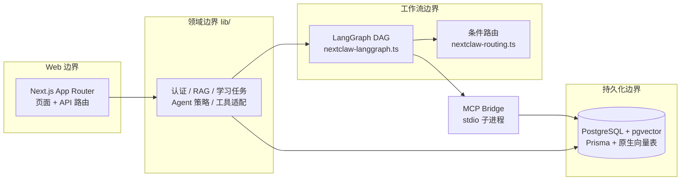

<div align="center">

# 🧠 NexMind

**把笔记变成可检索的知识、可追溯的 Agent 工作流、可复习的学习计划**

一个自托管的个人 AI 知识操作系统（Knowledge OS）

[](https://github.com/PengYu6669/NexMind/actions/workflows/ci.yml)


[核心特性](#-核心特性) · [架构设计](#-架构设计) · [快速开始](#-快速开始) · [生产部署](#-生产部署) · [常见问题](#-常见问题)

</div>

---

## 💡 为什么做 NexMind

大多数 AI 笔记应用停留在「聊天」或「语义搜索」。NexMind 把**学习本身**建模成一条可观测的工作流：

```text
捕获 → 索引 → 检索 → 决策 → 搜索/审计 → 规划 → 执行 → 辅导 → 沉淀 → 复习
```

每个学习任务都记录可序列化的 `steps`、工具调用结果、重试、降级和最终状态。你不仅能问 AI，还能**看到 AI 是如何一步步学习和验证你的知识的**。

## ✨ 核心特性

| | 特性 | 说明 |
|---|---|---|
| 📝 | **富文本知识库** | Tiptap 编辑器，支持文件夹、标签、归档/置顶、双链笔记、附件上传 |
| 🔍 | **混合 RAG 检索** | pgvector 向量检索 + 中文分词全文检索，结构化分块，1024 维 embedding |
| 💬 | **流式对话** | 多会话聊天，SSE 流式输出，自动携带笔记/卡片上下文 |
| 🤖 | **NextClaw Agent** | LangGraph DAG：supervisor 调度 → 知识检索 → 联网搜索 → 内容审计 → 学习规划 → 执行 → 辅导 → 持久化 |
| 🃏 | **间隔复习** | 自动生成学习卡片，SM-2 调度算法，AI 评分答案并标注掌握/遗漏要点 |
| 🕸️ | **知识图谱** | React Flow 可视化笔记关联与 Agent 工作流执行轨迹 |
| 🔌 | **MCP 工具链** | 单一 stdio bridge 聚合读笔记、语义搜索、联网搜索、网页抓取、知识审计五个工具 |
| 🛡️ | **安全设计** | Zod API 契约、用户数据所有权校验、SSRF 防护、限流、cron 鉴权 |

## 🏗 架构设计



**关键设计决策：**

- **异步任务队列**：`LearningJob` 用 PostgreSQL `FOR UPDATE SKIP LOCKED` 原子认领，支持租约、有界重试、退避和 `WAITING_INPUT`（人机协同）——不依赖 Redis/MQ，一个数据库搞定
- **显式降级**：MCP、联网搜索、OCR、对象存储均为可选能力，缺失时走本地兜底或显式降级状态，绝不静默失败
- **纯函数路由**：LangGraph 条件边的决策逻辑独立在 `lib/nextclaw-routing.ts`，100% 单测覆盖
- **原生向量表**：RAG 分块表刻意不进 Prisma 模型，由审查过的迁移和运行时 schema 校验管理

## 🚀 快速开始

### 环境要求

- Node.js 20+
- Docker Desktop
- 一个 OpenAI 兼容的 chat/embedding 服务（当前适配豆包/火山方舟）

### 三步跑起来

```bash
# 1. 启动数据库（pgvector，本地端口 55432）
docker compose up -d

# 2. 安装依赖并应用迁移
npm install
npm run db:deploy

# 3. 启动开发服务器
npm run dev
```

访问 `http://localhost:3000`（端口被占时 `npm run dev -- -p 3002`）。

### 环境变量

复制 `.env.example` 为 `.env`，最小必填项：

| 变量 | 说明 |
|---|---|
| `DATABASE_URL` | PostgreSQL 连接串（本地对应 Compose 的 55432 端口）|
| `AUTH_JWT_SECRET` | JWT 签名密钥，生成一个长随机串 |
| `AI_API_KEY` / `AI_API_BASE_URL` | OpenAI 兼容服务的密钥与地址 |
| `AI_MODEL_CHAT` / `AI_MODEL_EMBEDDING` | 对话与向量模型名 |
| `AI_EMBEDDING_DIMENSION` | 向量维度，**当前迁移契约为 1024** |

可选集成：`SERPAPI_API_KEY`（联网搜索）、`NEXTCLAW_MCP_ENABLED`（MCP 工具链）、`VOLC_TOS_*`（对象存储）、`BAIDU_OCR_*`（图片识字）、`INTERNAL_CRON_TOKEN`（定时任务鉴权）。

## 📦 生产部署

仓库自带完整的自托管方案（单机 Docker Compose，2C4G 服务器即可运行）：

```bash
git clone https://github.com/PengYu6669/NexMind.git && cd NexMind
cp .env.example .env        # 填好密钥（国内服务器可设 NPM_REGISTRY 加速构建）
docker compose -f docker-compose.prod.yml up -d --build
```

包含四个服务：**app**（启动时自动 `prisma migrate deploy`）、**postgres**（pgvector，不暴露公网）、**cron**（定时触发学习任务）、**caddy**（可选，自动 HTTPS）。

已有 nginx 的服务器可改用 vhost 接入（app 只绑本机回环端口），参考 `deploy/nginx-nexmind.conf`，配合 certbot 一条命令上 HTTPS。SSE 反代必须关闭缓冲（配置中已含 `proxy_buffering off`）。

验证部署：

```bash
curl http://127.0.0.1:3001/api/health/ready
# → {"ok":true,"status":"ready","checks":{"database":"ok","ragSchema":"ok"}}
```

## 🧪 质量门禁

所有变更必须通过五连门禁（CI 中使用真实 pgvector 库执行）：

```bash
npm run lint        # ESLint 零报错
npm run typecheck   # TypeScript 检查
npm run test        # Vitest 单测（API 契约 / 路由决策 / 分块 / 限流 / SSRF）
npm run test:core   # 真库集成测试（迁移 / 向量 schema / 任务生命周期 / cron 鉴权）
npm run build       # 生产构建
```

健康检查端点：`GET /api/health/live`（进程存活）、`GET /api/health/ready`（数据库与 RAG schema 就绪）。

## 🗺 项目结构

```text
├── app/                        # 页面路由与 API 边界
├── components/                 # UI 组件（layout / notes / nextclaw / graph ...）
├── lib/                        # 领域逻辑
│   ├── nextclaw-langgraph.ts   #   工作流图组装与节点执行
│   ├── nextclaw-routing.ts     #   纯函数条件边决策（必须有测试）
│   ├── nextclaw-agent-tools.ts #   MCP 优先、本地兜底的工具层
│   ├── rag.ts                  #   分块索引 / 向量化 / 混合检索 / schema 校验
│   └── learning-jobs-runner.ts #   队列原子认领 / 租约 / 重试
├── mcp-servers/nextclaw-bridge # 单一 stdio MCP server（5 个工具）
├── prisma/                     # 领域模型与已审查的迁移历史
├── deploy/                     # 生产部署资产（nginx / cron / 环境引导）
├── tests/                      # 单元与策略测试
└── docs/项目地图.md             # 代码阅读路线与所有权清单
```

## ❓ 常见问题

<details>
<summary><b>为什么不部署到 Vercel？</b></summary>

NexMind 是有状态的长驻应用：MCP 走 stdio 子进程、学习任务在后台长时间运行、SSE 长连接、任务队列依赖 `SKIP LOCKED`。Serverless 平台的执行时长与进程模型都不适配，自托管 Docker 是正确姿势。
</details>

<details>
<summary><b>换 embedding 模型要注意什么？</b></summary>

向量维度是硬契约（当前 1024），迁移、插入、查询、索引四处必须一致。换维度需要新迁移并重建向量索引，不能只改环境变量。
</details>

<details>
<summary><b>MCP 工具在 IDE（Cursor 等）里怎么接？</b></summary>

Command `npx`（Windows 用 `npx.cmd`），Args `tsx mcp-servers/nextclaw-bridge/run.ts`，工作目录必须是仓库根，环境变量与 `.env` 一致。详见 `mcp-servers/README.md`。
</details>

<details>
<summary><b>没有 SerpAPI / OCR / 对象存储的 key 能用吗？</b></summary>

能。这些都是可选能力，缺失时对应工具返回显式降级状态，核心的笔记、RAG、学习工作流不受影响。
</details>

## 📄 License

私有项目，公开分发前请先添加许可证。
